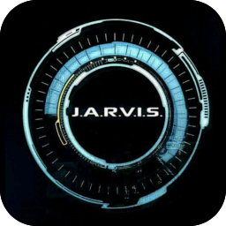
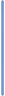

<head> <link rel="icon" href="./favicon.ico" /> </head>

<style>
@import url("https://nyteowldave.neocities.org/style.css");
</style>

<style>
#footer_input {
    width : calc( 100vw - 100px ) !important;
}
</style>

<style>
img {
    display    : inline-block;
    box-sizing : border-box;
    border     : 1px dashed gold;
}
img[sm] { width : 64px;  }
img[md] { width : 96px;  }
img[lg] { width : 120px; }
img[split] { border: none; }
</style>

<!-- ~~~~~~~~~~~~~~~~~~~~~~~~~~~~~~~~~~~~~~~~~~~~~~~~~~~~~~~ -->

[me-omega]:
<http://dave-omega/app/bluto/icons/icons-view.html>
"Omega Edition"

----------------------------------------------------------------

<div center>
 
</div>

# [Icon Viewer](./)

----------------------------------------------------------------

# Groups

| ID | Description         | Dimensions |
|----|---------------------|------------|
|  1 | Page Group          | 96 x 96    |
|  2 | Navigation Group    | 96 x 96    |
|  3 | Media Control Group | 96 x 96    |
|  4 | Shape Group         | 96 x 96    |
|  5 | Blank Group         | 96 x 96    |
|  6 | Button Group        | 212 x 96   |
|  7 | Big Group           | 290 x 290  |
|  8 | System              | 256 x 256  |
|  9 | Splitter            | varies     |

----------------------------------------------------------------

<div center>  </div>

----------------------------------------------------------------

# Pages (1)

| ID  | Group ID | Filename                   |
|-----|----------|----------------------------|
| 101 | 1        | page-accept.png            |
| 103 | 1        | page-blank.png             |
| 103 | 1        | page-copy.png              |
| 104 | 1        | page-editor.png            |
| 105 | 1        | page-lined.png             |
| 106 | 1        | page-new.png               |
| 107 | 1        | page-reject.png            |
| 108 | 1        | page-starred.png           |

<div center>
 
 
 
 
 
 
 
 
</div>

----------------------------------------------------------------

<div center>  </div>

----------------------------------------------------------------

# Navigation (2)

| ID  | Group ID | Filename                   |
|-----|----------|----------------------------|
| 201 | 2        | nav-bookmark.png           |
| 202 | 2        | nav-chat.png               |
| 203 | 2        | nav-decals.png             |
| 204 | 2        | nav-favorites.png          |
| 205 | 2        | nav-help.png               |
| 206 | 2        | nav-home.png               |
| 207 | 2        | nav-mail.png               |
| 208 | 2        | nav-refresh.png            |
| 209 | 2        | nav-search.png             |

----------------------------------------------------------------

<div center>
 
 
 
 
 
 
 
 
 
</div>

----------------------------------------------------------------

<div center>  </div>

----------------------------------------------------------------

# Media Control (3)

| ID  | Group ID | Filename                   |
|-----|----------|----------------------------|
| 301 | 3        | mac-fast-forward.png       |
| 302 | 3        | mac-next.png               |
| 303 | 3        | mac-pause.png              |
| 304 | 3        | mac-play.png               |
| 305 | 3        | mac-previous.png           |
| 306 | 3        | mac-rewind.png             |
| 307 | 3        | mac-stop.png               |

----------------------------------------------------------------

<div center>
 
 
 
 
 
 
 
</div>

----------------------------------------------------------------

<div center>  </div>

----------------------------------------------------------------

# Shapes ( 4 )

| ID  | Group ID | Filename                   |
|-----|----------|----------------------------|
| 401 | 4        | accept-circle.png          |
| 402 | 4        | accept-square.png          |
| 403 | 4        | menu-square.png            |
| 404 | 4        | reject-square.png          |

----------------------------------------------------------------

<div center>
 
 
 
 
</div>

----------------------------------------------------------------

<div center>  </div>

----------------------------------------------------------------

# Blanks ( 5 )

| ID  | Group ID | Filename                   |
|-----|----------|----------------------------|
| 501 | 5        | square-empty.png           |
| 502 | 5        | circle-empty.png           |

----------------------------------------------------------------

<div center>
 
 
</div>

----------------------------------------------------------------

<div center>  </div>

----------------------------------------------------------------

# Buttons ( 6 )

| ID  | Group ID | Filename                   |
|-----|----------|----------------------------|
| 601 | 6        | button-blank.png           |

----------------------------------------------------------------

<div center>
 
</div>

----------------------------------------------------------------

<div center>  </div>

----------------------------------------------------------------

# Big Icons ( 7 )

| ID  | Group ID | Filename                   |
|-----|----------|----------------------------|
| 701 | 7        | square-empty-290x290.png   |
| 702 | 7        | circle-checked-290x290.png |
| 703 | 7        | circle-empty-290x290.png   |

----------------------------------------------------------------

<div center>
 
 
 
</div>

----------------------------------------------------------------

<div center>  </div>

----------------------------------------------------------------

# System ( 8 )

| ID  | Group ID | Filename                   |
|-----|----------|----------------------------|
| 801 | 8        | bluto.png                  |
| 802 | 8        | jarvis.png                 |

----------------------------------------------------------------

<div center>
 
 
</div>

----------------------------------------------------------------

<div center>  </div>

----------------------------------------------------------------

# Splitter ( 9 )

| ID  | Group ID | Filename                   |
|-----|----------|----------------------------|
| 901 | 9        | splitter-hz-blue.png       |
| 902 | 9        | splitter-vt-blue.png       |

----------------------------------------------------------------

<div center>
 
 
</div>

----------------------------------------------------------------

<div center>  </div>

----------------------------------------------------------------

# Table Templates

```

| ID | Group ID | Filename                   |
|----|----------|----------------------------|
|    |          |                            |

| ID | Description         | Dimensions |
|----|---------------------|------------|
|    |                     |            |

```

----------------------------------------------------------------

<div center>  </div>

----------------------------------------------------------------

# Future Ideas

- Button `Menu Builder` (drag-drop icons)
- Add `Bluto` to GitHub Repo `Checklist`

----------------------------------------------------------------

<footer if="footer">
  <input id="footer_input" onchange="perform( event )" />
</footer>

<header id="messages"></header>

<script>
   function message( s ) { messages.textContent = ( s ); }
</script>

----------------------------------------------------------------

> [Omega][me-omega]
> [Bluto Menu](./../bluto-menu.html)

> [Folder Tree](./tree.php)
> [File System](./)

> [Icon List](./icon.list)
> [File List](./file.list)
> [Folder List](./folder.list)
> [Explore List](./explore.list)

----------------------------------------------------------------

<script>
;
; iwm = Object.keys( window ).sort()
;
</script>

<script>
;
; doc = document
;
</script>

<script>
;
; doc . title
= doc . querySelector( "H1" )
. textContent
;
</script>

<script>
;
; cls =()=> console.clear()
; agn =()=> location.reload()
;
</script>

<script>
;
; veer =( h )=> ( location.hostname = ( h ) )
;
</script>

<!-- ~~~~~~~~~~~~~~~~~~~~~~~~~~~~~~~~~~~~~~~~~~~~~~~~~~~~~~~ -->

<script src="https://nyteowldave.github.io/std/api/gems/prolog-beta.js">
</script>

<script src="https://nyteowldave.github.io/std/api/gems/interpreter-lite.js">
</script>

<script src="https://nyteowldave.github.io/std/api/install.js">
</script>

<!-- ~~~~~~~~~~~~~~~~~~~~~~~~~~~~~~~~~~~~~~~~~~~~~~~~~~~~~~~ -->

<script>

function suggest( s ) {
    footer_input.value = ( s );
}

</script>

<!-- ~~~~~~~~~~~~~~~~~~~~~~~~~~~~~~~~~~~~~~~~~~~~~~~~~~~~~~~ -->

<script>

function main( event ) {
    try {
        suggest( "install('hud')" );
        message( "Hey, load the HUD!" );
    } catch ( e ) {
        console.error ( e );
        alert ( e );
    }
}

addEventListener( "load", main );

</script>

<!-- ~~~~~~~~~~~~~~~~~~~~~~~~~~~~~~~~~~~~~~~~~~~~~~~~~~~~~~~ -->


